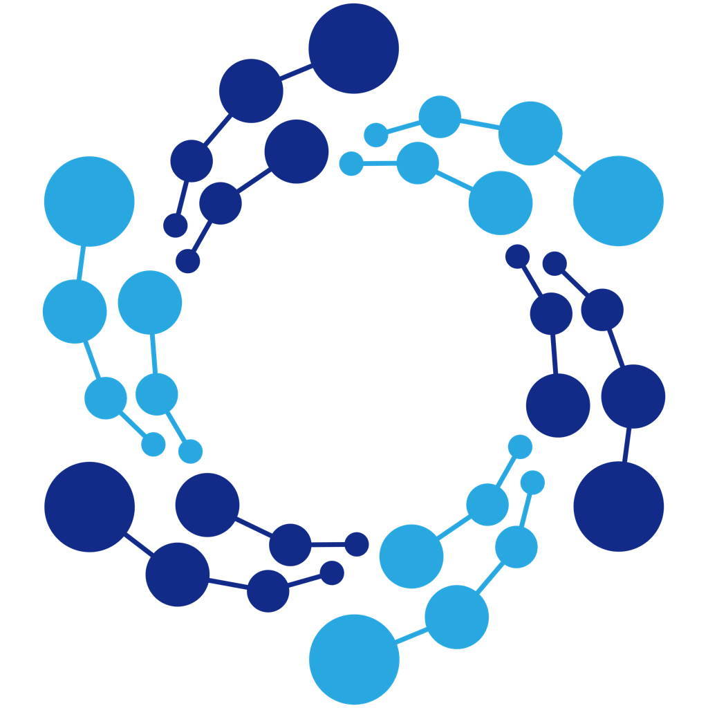

<p align="center">
  
</p>

# <p align="center">TOS Network</p>

<p align="center">Official Rust implementation of the TOS Network protocol.</p>

## Overview

TOS Network is a next-generation blockchain platform built with Rust, focusing on scalability, security, and performance.

## Components

- **tos_daemon** - Blockchain node daemon
- **tos_miner** - Mining program
- **tos_wallet** - Wallet application
- **tos_genesis** - Genesis block generator
- **tos_ai_miner** - AI mining program

## Quick Start

### Building

```bash
# Local build
./build_local.sh

# Cross-platform build
./build_all.sh
```

### Running with Docker

```bash
# Start daemon
docker-compose up tos-daemon

# Start with miner
docker-compose --profile miner up
```

### Manual Build

```bash
# Development build
cargo build

# Release build
cargo build --release
```

## Documentation

- [Build Guide](BUILD.md) - Detailed build instructions
- [Docker Guide](DOCKER.md) - Docker deployment guide

## Contributing

Contributions are welcome! Please read our contribution guidelines before submitting pull requests.

## License

This project is licensed under the BSD 3-Clause License. See the [LICENSE](LICENSE) file for details.

## Links

- Website: [https://tos.network](https://tos.network)
- Repository: [https://github.com/tos-network/tos](https://github.com/tos-network/tos)

---

**TOS Network** - Next Generation Blockchain Network 🚀
